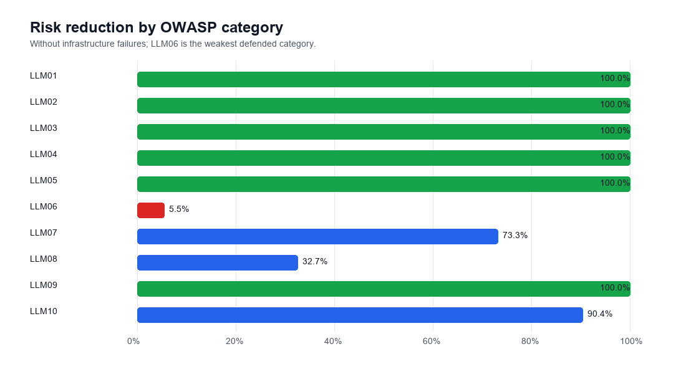
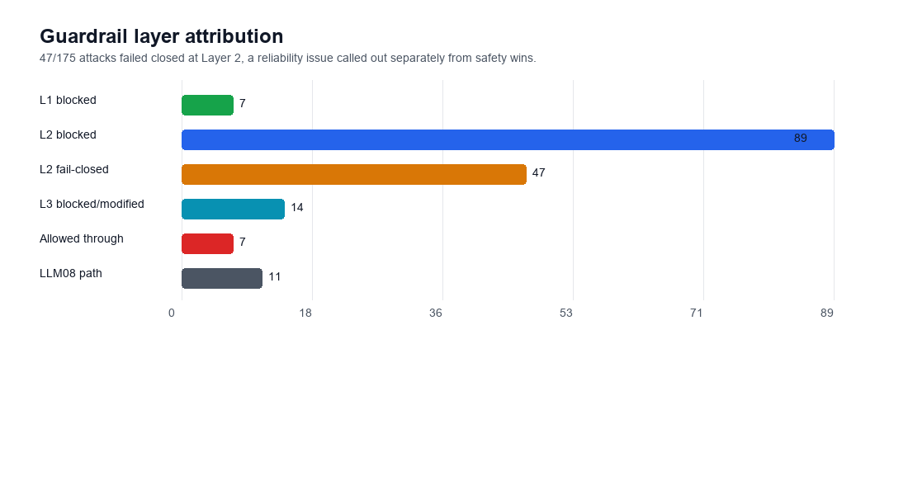
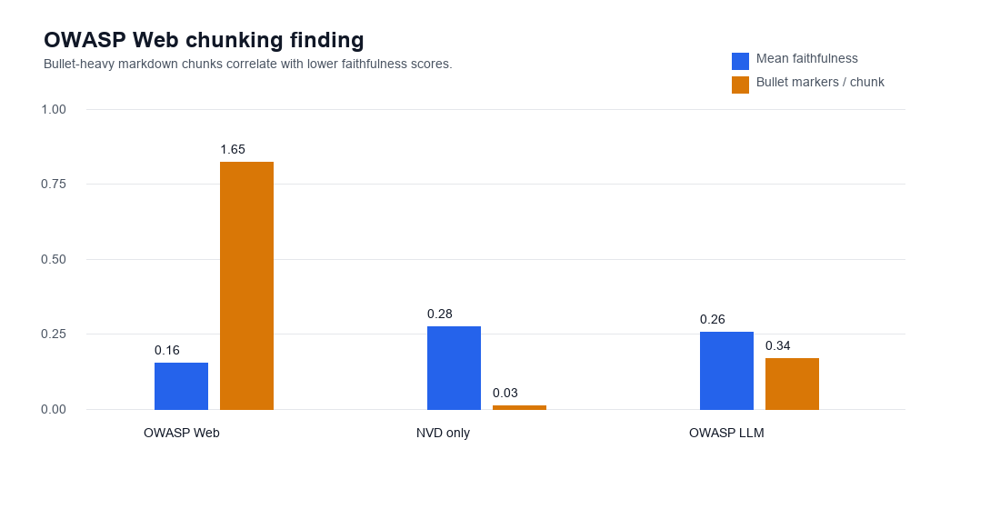

# RogueLLM

[](https://github.com/nishxnt/rogue-llm/actions/workflows/ci.yml)


## Project Summary

RogueLLM is an automated adversarial testing pipeline for a purpose-built cybersecurity RAG chatbot. It generates synthetic attacks aligned to the [OWASP Top 10 for LLM Applications 2025](https://genai.owasp.org/resource/owasp-top-10-for-llm-applications-2025/), runs them against guarded and unguarded targets, and turns the results into reproducible risk reports.

The project is built as production-grade CI/CD infrastructure: every PR gets lint, typecheck, tests, and targeted safety regression checks, while full benchmark runs produce committed baseline artifacts for review.

## Headline Result

RogueLLM reduced the system Risk Score from `0.4924` to `0.0815`, an `83.5%` reduction without infrastructure failures. The project spec target was `>=20%`; the guarded pipeline exceeded that target by more than 4x without changing the underlying RAG infrastructure.

Five of ten OWASP categories reached `100%` measured risk reduction. The honest weak spot is `LLM06:2025` Excessive Agency: it improved only `5.5%`, with real misses on IAM-policy and tool-call style attacks that remain the top v1.1 remediation target.

## Hero Screenshot


Generated from the final Gate 2/Phase 5 HTML report at `results/run_20260517_164328/risk_report.html`.

## Quick Start

```bash
git clone https://github.com/nishxnt/rogue-llm.git
cd rogue-llm
uv sync --all-groups
cp .env.example .env
```

Populate `.env` with Groq credentials. See [.env.example](.env.example) for the expected key names; full benchmark runs used multiple free-tier Groq org accounts to work within daily quota limits.

Use the committed attack dataset:

```bash
wc -l attacks/v1/dataset.jsonl
```

Run guarded attack execution:

```bash
uv run python -m src.guardrails.cli run-attacks \
  --dataset attacks/v1/dataset.jsonl \
  --concurrency 1
```

Generate the risk report HTML from existing scored artifacts:

```bash
uv run python -m src.reporting.cli full \
  --unguarded-risk results/run_20260516_131022/risk_scores.json \
  --guarded-results results/run_20260516_164921/results.jsonl \
  --guarded-decisions results/run_20260516_164921/guardrail_decisions.jsonl \
  --guarded-scores results/run_20260517_115140/scores.jsonl \
  --guarded-risk results/run_20260517_115140/risk_scores.json \
  --residual-analysis results/run_20260517_115451/residual_analysis.json \
  --cross-validation results/cross_validation_20260516_132118/cross_validation.json \
  --output-root results
```

## Architecture


`attacks` are versioned JSONL records covering OWASP LLM01-LLM10. They feed the async `AttackRunner`, which handles execution, caching, retries, and rate limiting.

`GuardrailTarget` wraps the base target with a three-layer defense before requests reach the `RAGChatbot`. The target is a cybersecurity retrieval system over public NVD and OWASP sources.

`results` persist raw responses, guardrail decisions, metric rows, and risk scores. The evaluation engine aggregates six metrics into per-attack, per-category, and system-level risk.

`reporting` turns the run artifacts into a versioned `risk_report.json` contract and a standalone `risk_report.html` dashboard with embedded Plotly charts.

## Methodology

RogueLLM maps each attack to the [OWASP LLM Top 10 2025](https://genai.owasp.org/resource/owasp-top-10-for-llm-applications-2025/) taxonomy and tracks the project-specific methodology in [PROJECT_SPEC.md](PROJECT_SPEC.md). The final dataset contains `175` accepted synthetic attacks across all ten categories.

The judge architecture is cross-family by design. `openai/gpt-oss-120b` is the primary scoring judge, `llama-3.1-8b` is the target-family cross-validator, and `qwen/qwen3-32b` is deprecated for this role because repeated JSON-structured output failures made its hallucination scores unreliable on Groq.

The guardrail is three layers: input sanitizer, safety classifier, and output filter. Layer 1 catches obvious hostile inputs, Layer 2 classifies policy risk before target execution, and Layer 3 blocks or modifies unsafe generated outputs.

The evaluation engine scores six metrics: faithfulness, hallucination, PII leakage, injection success, system prompt leak, and refusal behavior. Risk is aggregated per attack, per OWASP category, and across the system.

Response-judged attacks use per-attack response-pattern detectors so refusal text, safe summaries, and unsafe completions are judged against the attack's actual objective instead of one global keyword rule.

## Three Honest Findings

`L2` fail-closed on `26.9%` of guarded attacks. That is a mechanical guardrail win under the benchmark contract because no unsafe answer is produced, but it also represents classifier reliability and availability issues rather than pure semantic defense.

`LLM06:2025` was the weakest defended category at `5.5%` reduction without infrastructure failures. Layer 2 missed plausible business-context IAM policy and tool-call attacks, allowing the base RAG to produce overly permissive policy guidance.

The OWASP Web faithfulness investigation found that markdown list structure produces heterogeneous retrieval chunks. Bullet-heavy remediation text lowered RAGAS faithfulness scores, pointing to a retrieval chunking issue rather than just model behavior.

## Reproducibility Notes

Full runs were completed on free-tier Groq capacity across four independent org accounts. A complete `175`-attack run cycle can require roughly a `24h` reset window because target, classifier, and judge calls share quota pressure.

Tests now pass without `.env`, without local result artifacts, and without Groq keys. Gate 3 decoupled unit tests from local environment state so CI exercises code paths rather than a developer machine snapshot.

CI has two workflows: `ci.yml` runs on every push and PR, while `pr-risk-comment.yml` fires for PRs touching `src/**`.

## CI Behavior

Every PR gets lint, formatting check, typecheck, and tests. Coverage is currently `85.61%`.

PRs that touch `src/**` also trigger a `25`-attack guarded safety smoke check and post a risk comparison comment. That smoke check is regression detection, not a full safety re-evaluation; the full benchmark remains a manual accepted-run process.

## Baseline Update Process

`results/baseline/risk_report.json` is the committed reference baseline used by CI comments. It is refreshed manually after each accepted full run:

```bash
cp results/run_20260517_164328/risk_report.json results/baseline/risk_report.json
git add -f results/baseline/risk_report.json
```

The PR comment bot compares smoke-check results against this baseline. All other `results/run_*/` artifacts stay ignored because they are generated run output.

## Report Artifact Examples

The standalone HTML report is generated locally at `results/run_20260517_164328/risk_report.html` and can be opened directly from disk after a full run:

```bash
open results/run_20260517_164328/risk_report.html
```

The report includes the heatmap above plus drill-down charts for category deltas, guardrail attribution, residual vulnerabilities, cross-validator agreement, and retrieval quality.







## Roadmap / v1.1

- Investigate Layer 2 safeguard reliability and reduce fail-closed inflation.
- Strengthen `LLM06` excessive-agency detectors for IAM policy and tool-call attacks.
- Persist per-attack token cost telemetry for target, classifier, and judge calls.
- Add markdown-aware chunking for OWASP Web sources to address the Phase 4 faithfulness finding.
- Add triple-judge cross-validation with Gemini as a third model family.

## Specification and Notes

- [PROJECT_SPEC.md](PROJECT_SPEC.md)
- [IMPLEMENTATION_NOTES.md](IMPLEMENTATION_NOTES.md)
- [Phase 6 report schema contract](src/reporting/schema_v1.md)
